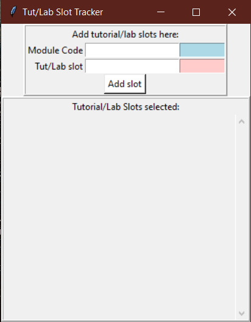
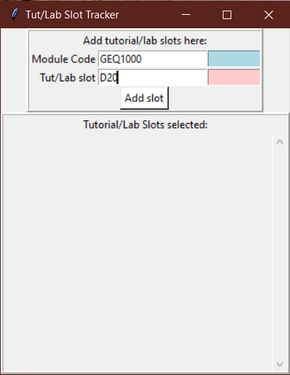
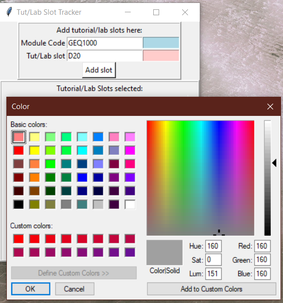
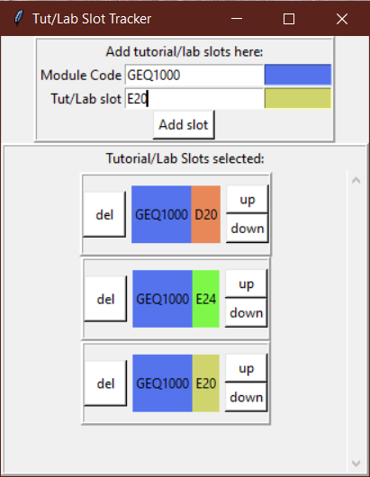

# ModReg Tut/Lab Slot Tracker
A simple tool to use for tutorial & lab bidding for tracking & ranking your selected slots.  
NOTE: This tool is meant to be used only for keeping track of the slots selected, it is NOT linked with ModReg at all.

## Requirements
- Python 3 (written with Python 3.7, might work with older versions of Python 3)
- `tkinter` Python package (should be in-built with Python 3)

## Setup
- Clone/Download `tut_lab_tracker.py`.
- To start the app, run: `python "path/to/tut_lab_tracker.py"` from the command line.

## Guide
- On starting the app, you should see this:     
    
- Fill in the module code & name of the tutorial/lab slot in the white entry fields:    
    
- The module code and tut/lab name will be displayed in colored boxes, choose the color of these boxes by clicking the colored region next to the entry field:    
    
- Once that's done, hit `Add slot` to add the tut/lab slot to the list:    
    
- More slots can be added following the previous steps.
- Change the ranking of your tut/lab slots using the `up` and `down` buttons.
- Delete unwanted slots using the `del` buttons.
